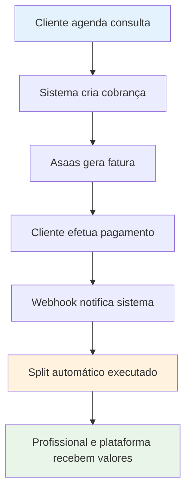

# Medical API

API RESTful e interface web para gerenciamento de profissionais da saúde e consultas médicas.

## Recursos

- Cadastro, edição, exclusão e listagem de profissionais da saúde
- Cadastro e edição de consultas médicas com vínculo ao profissional
- Busca por consultas utilizando o ID do profissional
- Interface web com estatísticas e visualização de consultas em tempo real
- Segurança e validação de dados

## Tecnologias utilizadas

- Django 5.2.2
- Django REST Framework
- PostgreSQL
- Docker e Docker Compose
- Templates Django para renderização no lado do servidor
- JavaScript para interatividade na interface web
- Poetry para gerenciamento de dependências

## Configuração do ambiente

### Usando o script automatizado

1. Clone o repositório
2. Execute o script de configuração:

```bash
# Execução interativa com confirmações
./setup.sh

# Execução com configurações padrão (sem confirmações)
./setup.sh -y

# Mostrar opções de ajuda
./setup.sh -h
```

O script oferece duas opções de configuração:

1. **Docker (recomendado)**: Inicia os containers e configura todo o ambiente
2. **Local com Poetry**: Instala dependências e configura o ambiente local

Funcionalidades do script:

- Verifica se o arquivo `.env` existe e o cria a partir do exemplo se necessário
- Detecta automaticamente o Docker Compose V2 ou V1
- Oferece opção para resetar o banco de dados e carregar dados iniciais
- Permite criar um superusuário para acesso ao admin
- Aguarda a inicialização do banco de dados para evitar erros
- Exibe links úteis para acessar a API e o painel administrativo

O script é compatível com Docker Compose V2 (comando `docker compose`) e Docker Compose V1 (comando `docker-compose`).

### Configuração manual

1. Clone o repositório
2. Crie um arquivo `.env` baseado no `.env.example`:

```bash
cp .env.example .env
```

3. Edite o arquivo `.env` com suas configurações
4. Instale as dependências:

```bash
poetry install
```

5. Execute as migrações:

```bash
poetry run python manage.py migrate
```

6. Crie um superusuário:

```bash
poetry run python manage.py createsuperuser
```

7. Inicie o servidor:

```bash
poetry run python manage.py runserver
```

### Usando Docker Compose

1. Clone o repositório
2. Crie um arquivo `.env` baseado no `.env.example`
3. Execute:

```bash
# Para Docker Compose V2
docker compose up -d

# OU para Docker Compose V1
docker-compose up -d
```

4. Crie um superusuário para acessar o admin:

```bash
# Para Docker Compose V2
docker compose exec web python manage.py createsuperuser

# OU para Docker Compose V1
docker-compose exec web python manage.py createsuperuser
```

## Resetando o banco de dados

### Usando Docker (Recomendado)

Para resetar o banco de dados e carregar dados iniciais quando estiver usando Docker:

```bash
# Executar o script auxiliar que gerencia o processo através do Docker
./reset_docker_db.sh

# Para pular a confirmação
./reset_docker_db.sh -y

# Para ver ajuda
./reset_docker_db.sh -h
```

Este script irá:

1. Verificar se o Docker e Docker Compose estão instalados
2. Detectar automaticamente a versão do Docker Compose (V1 ou V2)
3. Verificar se os containers estão rodando e iniciá-los se necessário
4. Executar o comando de reset do banco de dados dentro do container
5. Carregar dados iniciais

O script é compatível com Docker Compose V2 (comando `docker compose`) e Docker Compose V1 (comando `docker-compose`).

### Comando direto

Se você estiver dentro do container ou configurou o ambiente manualmente:

```bash
# Comando básico
python manage.py reset_db

# Sem confirmação
python manage.py reset_db --no-input

# Sem carregar dados iniciais
python manage.py reset_db --no-seed
```

O reset do banco de dados:

1. Remove todas as tabelas
2. Recria as migrações
3. Cria um superusuário admin (senha definida em .env)
4. Cria 5 profissionais de exemplo
5. Cria 3 consultas para cada profissional

## Documentação da API

A documentação da API está disponível em:

- `/api/docs/` - Interface Swagger
- `/api/redoc/` - Interface ReDoc
- `/api/schema/` - Schema OpenAPI

## Endpoints da API

### Endpoints para Profissionais da Saúde

| Método | Endpoint | Descrição |
|--------|----------|-----------|
| GET | `/api/professionals/` | Lista todos os profissionais da saúde |
| POST | `/api/professionals/` | Cadastra um novo profissional da saúde |
| GET | `/api/professionals/{id}/` | Recupera os detalhes de um profissional específico |
| PUT | `/api/professionals/{id}/` | Atualiza completamente um profissional |
| PATCH | `/api/professionals/{id}/` | Atualiza parcialmente um profissional |
| DELETE | `/api/professionals/{id}/` | Remove um profissional do sistema |

**Exemplo de JSON para cadastro de profissional:**

```json
{
  "preferred_name": "Dr. Ana Silva",
  "profession": "Cardiologista",
  "specialty": "Cardiologia Pediátrica",
  "address": "Av. Paulista, 1000 - São Paulo/SP",
  "contact": "11987654321"
}
```

**Parâmetros de filtro:**

- `?search=termo` - Busca pelo nome ou profissão
- `?ordering=field` - Ordenação por campo (ex: preferred_name, -created_at para ordem decrescente)

### Endpoints para Consultas Médicas

| Método | Endpoint | Descrição |
|--------|----------|-----------|
| GET | `/api/appointments/` | Lista todas as consultas médicas |
| POST | `/api/appointments/` | Cadastra uma nova consulta médica |
| GET | `/api/appointments/{id}/` | Recupera os detalhes de uma consulta específica |
| PUT | `/api/appointments/{id}/` | Atualiza completamente uma consulta |
| PATCH | `/api/appointments/{id}/` | Atualiza parcialmente uma consulta |
| DELETE | `/api/appointments/{id}/` | Remove uma consulta do sistema |
| GET | `/api/appointments/?professional={professional_id}/` | Busca todas as consultas de um profissional específico por ID |

**Exemplo de JSON para cadastro de consulta:**

```json
{
  "date": "2025-06-15T14:30:00Z",
  "professional": 1
}
```

**Parâmetros de filtro:**

- `?professional=1` - Filtra por ID do profissional
- `?date=2025-06-15T14:30:00Z` - Filtra por data exata
- `?date_start=2025-06-01T00:00:00Z` - Filtra por data maior ou igual
- `?date_end=2025-06-30T23:59:59Z` - Filtra por data menor ou igual
- `?ordering=date` - Ordenação por data (use -date para ordem decrescente)

## Interface Web

### Acesso às páginas principais

- **Interface principal**: `http://localhost:8000/`
- **Painel Admin**: `http://localhost:8000/admin/`
- **Documentação API**: `http://localhost:8000/api/docs/`

### Funcionalidades da Interface Web

A interface web oferece:

1. **Visão geral do sistema**
   - Total de profissionais cadastrados
   - Total de consultas agendadas
   - Total de especialidades disponíveis

2. **Seção de especialidades**
   - Listagem de todas as especialidades disponíveis
   - Profissionais associados a cada especialidade

3. **Próximas consultas**
   - Tabela responsiva com as próximas consultas agendadas
   - Contador regressivo mostrando o tempo restante até cada consulta
   - Informações do profissional e especialidade

4. **Formulário de contato**
   - Interatividade com feedback visual
   - Validação de campos obrigatórios

5. **Design responsivo**
   - Adaptação para diferentes dispositivos e tamanhos de tela
   - Layout moderno e funcional

## Estrutura dos dados

### Profissionais

- `preferred_name` - Nome social
- `profession` - Profissão
- `address` - Endereço
- `contact` - Contato

### Consultas

- `date` - Data e hora da consulta
- `professional` - Profissional vinculado (chave estrangeira)

## Desenvolvimento

### Requisitos do sistema

- Python 3.12+
- Poetry 1.7.1+
- Docker e Docker Compose (recomendado)
- PostgreSQL (se não estiver usando Docker)

### Configuração do ambiente de desenvolvimento

Para um ambiente de desenvolvimento ideal, recomendamos usar o Docker:

```bash
# Instale o código e inicie os containers
./setup.sh

# Selecione a opção 1 (Docker)
```

### Comandos úteis para desenvolvimento

#### Com Docker

```bash
# Iniciar os containers
docker compose up -d

# Ver logs em tempo real
docker compose logs -f

# Executar comando dentro do container web
docker compose exec web python manage.py comando

# Parar os containers
docker compose down

# Parar e remover volumes (apaga dados do banco)
docker compose down -v
```

#### Sem Docker (ambiente local)

```bash
# Ativar ambiente virtual do Poetry
poetry shell

# Instalar dependências
poetry install

# Executar migrations
python manage.py migrate

# Iniciar servidor de desenvolvimento
python manage.py runserver

# Criar superusuário
python manage.py createsuperuser
```

## Solução de Problemas

### Problemas com Docker Compose

#### Comando `docker-compose` não encontrado, mas tenho Docker instalado

Se você instalou o Docker recentemente, provavelmente está usando o Docker Compose V2, que é integrado ao Docker CLI. Use:

```bash
docker compose
```

em vez de

```bash
docker-compose
```

O script `setup.sh` detecta automaticamente qual versão você está usando.

#### Erro ao conectar com o banco de dados

Verifique se:

1. O banco de dados está rodando:

```bash
docker compose ps
```

2. As configurações no arquivo `.env` correspondem às do `docker-compose.yml`

3. O container do banco de dados inicializou completamente (pode levar alguns segundos)

#### Erros de migração ou ModuleNotFoundError

Execute o script de reset do banco de dados:

```bash
./reset_docker_db.sh -y
```

#### Comando `reset_db` não encontrado

Se você receber o erro "Unknown command: 'reset_db'", verifique:

1. Se o app `core` está no `INSTALLED_APPS` (já configurado no projeto)
2. Reinicie o container web:
```bash
docker compose restart web
```
3. Verifique se os comandos estão disponíveis:
```bash
docker compose exec web python manage.py help
```

#### Problemas com permissões de arquivo

Se os scripts não executarem, verifique as permissões:

```bash
chmod +x setup.sh reset_docker_db.sh run_tests.sh
```

### Problemas com Poetry

#### Comando `poetry` não encontrado

Instale o Poetry seguindo a [documentação oficial](https://python-poetry.org/docs/#installation).

#### Dependências não instaladas corretamente

```bash
# Limpe o cache e reinstale
poetry cache clear --all pypi
poetry install --no-cache
```

## Estrutura do Projeto

A API está organizada em três aplicações Django principais:

### core

Contém configurações globais do projeto:

- `settings.py`: Configurações do Django
- `urls.py`: Roteamento principal da API
- `management/commands/reset_db.py`: Script para resetar o banco de dados

### professionals

Gerencia os profissionais da saúde:

- `models.py`: Define o modelo Professional
- `serializers.py`: Serializa dados do modelo para JSON
- `views.py`: Define o ProfessionalViewSet com filtros
- `urls.py`: Configura as rotas da API para profissionais
- `admin.py`: Configura a interface administrativa

### appointments

Gerencia as consultas médicas:

- `models.py`: Define o modelo Appointment
- `serializers.py`: Serializa dados do modelo para JSON
- `views.py`: Define o AppointmentViewSet com filtros
- `urls.py`: Configura as rotas da API para consultas
- `admin.py`: Configura a interface administrativa

### Scripts de Utilitário

- `setup.sh`: Configura o ambiente inicial
- `reset_docker_db.sh`: Reseta o banco de dados no Docker
- `run_tests.sh`: Executa os testes automaticamente
- `docker-compose.yml`: Configuração dos serviços Docker

## Testes

O projeto inclui uma suíte abrangente de testes com cobertura de 72,82%, incluindo testes de API, modelos e integração.

### Executando Testes

#### Usando o script automatizado (Recomendado)

```bash
# Executar testes (automático)
./run_tests.sh

# Forçar execução local
./run_tests.sh --local

# Ver ajuda
./run_tests.sh --help
```

O script `run_tests.sh` automaticamente:
- Detecta se o Docker está disponível e rodando
- Usa SQLite em memória para testes mais rápidos quando não está no Docker
- Executa testes no container se estiver rodando

#### Como funciona a detecção automática de ambiente

O script detecta automaticamente qual ambiente usar:

1. **Docker disponível + containers rodando**: 
   - ✅ Executa no container com PostgreSQL
   - ✅ Cria banco de teste temporário
   - ✅ Executa migrações e seeders
   - ✅ Remove banco após os testes

2. **Docker indisponível ou containers parados**:
   - ✅ Executa localmente com SQLite em memória
   - ✅ Mais rápido para desenvolvimento

#### Pipeline de testes no container

Quando executa no container, o script segue estes passos:

```
1. 🔍 Verificar se containers estão rodando
2. 📊 Criar banco de teste temporário (test_medical_api)
3. 🔧 Executar migrações no banco de teste
4. 🌱 Popular com dados iniciais (opcional)
5. 🧪 Executar testes com pytest
6. 🧹 Remover banco de teste (cleanup automático)
```

#### Métodos manuais

**1. Django test runner com SQLite (mais rápido):**
```bash
python manage.py test --settings=core.settings.testing
```

**2. Pytest com SQLite (mais informativo):**
```bash
DJANGO_SETTINGS_MODULE=core.settings.testing pytest -v
```

**3. Testes específicos por app:**
```bash
python manage.py test appointments.tests --settings=core.settings.testing -v 2
DJANGO_SETTINGS_MODULE=core.settings.testing pytest professionals/tests.py -v
```

**4. Testes dentro do container Docker:**
```bash
docker compose exec web python manage.py test --settings=core.settings.testing
```

**5. Cobertura detalhada com pytest:**
```bash
DJANGO_SETTINGS_MODULE=core.settings.testing pytest --cov=appointments --cov=professionals --cov-report=html --cov-report=term-missing
```

**6. Testes de integração específicos:**
```bash
python manage.py test appointments.tests.AppointmentIntegrationTestCase --settings=core.settings.testing
```

### Configurações de Teste

O projeto utiliza diferentes configurações para testes:

#### Para Container (PostgreSQL)
- **Arquivo**: `core/settings/development.py`
- **Banco**: PostgreSQL no container Docker
- **Database**: `test_medical_api` (temporário)
- **Vantagem**: Mesmo ambiente que desenvolvimento

#### Para Local (SQLite)  
- **Arquivo**: `core/settings/testing.py`
- **Banco**: SQLite em memória (`:memory:`)
- **Vantagem**: Mais rápido, sem dependências

### Factories para Testes
O projeto usa **Factory Boy** para criar dados de teste dinamicamente:

```python
# Exemplo de uso nas classes de teste
from tests.factories import ProfessionalFactory, AppointmentFactory

# Criar dados únicos automaticamente
professional = ProfessionalFactory()

# Customizar campos específicos
professional = ProfessionalFactory(
    preferred_name="Dr. João Silva",
    profession="Cardiologista"
)

# Criar múltiplos registros
professionals = ProfessionalFactory.create_batch(5)
```

### Estrutura dos Testes

#### Testes de API (`appointments/tests.py`, `professionals/tests.py`)
- Testes de CRUD completo
- Validação de dados
- Filtros e ordenação
- Autenticação e permissões

#### Testes de Modelo
- Validação de campos obrigatórios
- Representação string
- Ordenação padrão
- Timestamps automáticos

#### Testes de Integração
- Relacionamentos entre modelos
- Cascade delete
- Integridade referencial

### Resultados dos Testes

- **Total de testes**: 33 testes
- **Cobertura**: 72,82% (acima do mínimo exigido de 25%)
- **Status**: ✅ Todos os testes passando
- **Tempo de execução**: ~0.2-1.2 segundos (dependendo do método)

### Relatórios de Cobertura

Os relatórios HTML de cobertura são gerados automaticamente na pasta `htmlcov/`. Abra `htmlcov/index.html` no navegador para visualizar detalhes da cobertura.

## Configurações de Ambiente

### Variáveis de Ambiente (.env)

O projeto utiliza um arquivo `.env` para configurações sensíveis:

```bash
# Segurança
SECRET_KEY=sua_chave_secreta_aqui
DEBUG=True

# Configurações do Django
DJANGO_SETTINGS_MODULE=core.settings.development

# Banco de dados
DB_NAME=medical_db
DB_USER=user
DB_PASSWORD=password
DB_HOST=db  # Para Docker, use 'localhost' para ambiente local
DB_PORT=5432

# Superusuário automático
DJANGO_SUPERUSER_PASSWORD=admin123

# Hosts permitidos
ALLOWED_HOSTS=localhost,127.0.0.1
```

### Diferentes Ambientes

O projeto suporta múltiplos ambientes:

- **`development`**: Para desenvolvimento local com PostgreSQL
- **`testing`**: Para testes com SQLite em memória
- **`production`**: Para produção (configurações de segurança aprimoradas)

## API Reference

### Status Codes

A API utiliza os seguintes códigos de status HTTP:

- `200 OK` - Requisição bem-sucedida
- `201 Created` - Recurso criado com sucesso
- `204 No Content` - Recurso deletado com sucesso
- `400 Bad Request` - Dados inválidos na requisição
- `404 Not Found` - Recurso não encontrado
- `500 Internal Server Error` - Erro interno do servidor

### Formato de Erro

```json
{
  "field_name": [
    "Mensagem de erro específica"
  ],
  "non_field_errors": [
    "Erro geral da validação"
  ]
}
```

## Performance e Otimização

### Banco de Dados

- Índices automáticos em chaves estrangeiras
- Ordenação otimizada por timestamps
- Queries eficientes com select_related para profissionais

### Cache

O projeto está preparado para implementação de cache:
- Cache de sessão configurado
- Middleware de cache disponível
- Suporte a Redis (configuração manual necessária)

## Segurança

### Configurações de Segurança

- CSRF protection habilitado
- XFrame protection ativo
- Validação de hosts permitidos
- Middleware de segurança configurado

### Variáveis Sensíveis

Todas as configurações sensíveis são gerenciadas via variáveis de ambiente:
- Chaves secretas
- Credenciais de banco de dados
- Configurações de debug

## Contribuição

### Como Contribuir

1. Fork o projeto
2. Crie uma branch para sua feature (`git checkout -b feature/AmazingFeature`)
3. Commit suas mudanças (`git commit -m 'Add some AmazingFeature'`)
4. Push para a branch (`git push origin feature/AmazingFeature`)
5. Abra um Pull Request

### Padrões de Código

- Siga o PEP 8 para Python
- Use type hints quando possível
- Mantenha cobertura de testes acima de 70%
- Documente APIs com docstrings
- Escreva testes para novas funcionalidades

### Executando Testes Antes de Contribuir

```bash
# Execute todos os testes
./run_tests.sh

# Verifique a cobertura
DJANGO_SETTINGS_MODULE=core.settings.testing pytest --cov=. --cov-report=term-missing

# Verifique a formatação do código
poetry run black --check .
poetry run flake8 .
```

## Licença

Este projeto está licenciado sob a MIT License - veja o arquivo [LICENSE](LICENSE) para detalhes.

## Contato

Para dúvidas ou sugestões sobre o projeto, abra uma issue no GitHub.

## Verificação Rápida

Após a instalação, você pode verificar se tudo está funcionando:

### 1. Verificar se a API está respondendo
```bash
curl http://localhost:8000/api/docs/
```

### 2. Testar endpoints da API
```bash
# Listar profissionais
curl http://localhost:8000/api/professionals/

# Listar consultas
curl http://localhost:8000/api/appointments/
```

### 3. Executar os testes
```bash
./run_tests.sh
```

### 4. Acessar o admin
Vá para http://localhost:8000/admin/ e faça login com:
- Usuário: `admin`
- Senha: `admin123` (ou a definida em `.env`)

## Changelog

### v1.0.1
- ✅ Interface web com renderização do lado do servidor
- ✅ Página inicial com estatísticas em tempo real
- ✅ Visualização de próximas consultas com contador regressivo
- ✅ Listagem de especialidades disponíveis
- ✅ Formulário de contato interativo
- ✅ Design responsivo e moderno

### v1.0.0
- ✅ CRUD completo para profissionais da saúde
- ✅ CRUD completo para consultas médicas
- ✅ Filtros e busca avançada
- ✅ Documentação OpenAPI/Swagger
- ✅ Testes abrangentes (72,82% cobertura)
- ✅ Scripts de automação (setup, reset, testes)
- ✅ Suporte completo ao Docker
- ✅ Configurações multi-ambiente

## Roadmap

### v1.1.0 (Planejado)
- [ ] Autenticação e autorização
- [ ] Sistema de notificações
- [ ] API de relatórios
- [ ] Cache com Redis
- [ ] Logs estruturados
- [ ] Expansão da interface web

### v1.2.0 (Planejado)
- [ ] Listagem detalhada de profissionais
- [ ] Página de detalhes do profissional
- [ ] Agendamento online de consultas
- [ ] Integração com calendários
- [ ] Backup automático
- [ ] Métricas e monitoramento

# 💳 Integração com Asaas - Proposta de Implementação Robusta

Esta proposta apresenta uma visão conceitual da integração com o sistema de pagamentos [Asaas](https://www.asaas.com/) para automatizar o processo de cobrança de consultas médicas com split de pagamentos entre profissionais e plataforma.

---

## 🎯 Objetivos Estratégicos

### Objetivo Principal
Implementar um sistema automatizado de pagamentos que divida valores de forma transparente entre profissionais da saúde e a plataforma, garantindo:

- **Automatização completa** do fluxo de cobrança
- **Transparência financeira** em todas as transações
- **Escalabilidade** para crescimento da plataforma
- **Compliance** com regulamentações do setor

### Benefícios Esperados
✅ **Redução de custos operacionais** com processamento manual  
✅ **Melhoria na experiência** de usuários e profissionais  
✅ **Aumento na conversão** de consultas agendadas  
✅ **Rastreabilidade completa** de transações financeiras  
✅ **Preparação para escala** e novos mercados

---

## 🏗️ Arquitetura Conceitual

### Pilares da Solução

#### 1. **Processamento Assíncrono**
- Operações financeiras executadas em background
- Interface responsiva durante processamento
- Sistema de retry automático para falhas temporárias

#### 2. **Split de Pagamento Automatizado**
- Divisão configurável entre profissional e plataforma
- Cálculo automático de taxas e impostos
- Liquidação instantânea via Asaas

#### 3. **Segurança e Auditoria**
- Validação rigorosa de webhooks
- Log completo de todas as operações
- Controle de acesso baseado em perfis

#### 4. **Monitoramento e Observabilidade**
- Métricas em tempo real de pagamentos
- Alertas para falhas críticas
- Dashboard administrativo completo

---

## 💰 Modelo de Negócio

### Configuração de Split
```
Consulta: R$ 100,00
├── Profissional: R$ 85,00 (85%)
└── Plataforma: R$ 15,00 (15%)
```

### Fluxo Financeiro
1. **Agendamento**: Cliente agenda consulta com valor definido
2. **Cobrança**: Sistema gera cobrança automática via Asaas
3. **Pagamento**: Cliente efetua pagamento (PIX, cartão, boleto)
4. **Split**: Valor é dividido automaticamente
5. **Liquidação**: Cada parte recebe sua parcela instantaneamente

---

## 🔄 Fluxo de Integração



### Estados do Pagamento
- **PENDING**: Aguardando pagamento do cliente
- **PROCESSING**: Pagamento sendo processado
- **PAID**: Pagamento confirmado e split executado
- **FAILED**: Falha no processamento
- **REFUNDED**: Valor reembolsado

---

## 🛠️ Stack Tecnológico

### Componentes Principais
- **Backend**: Django REST Framework
- **Pagamentos**: API Asaas para cobrança e split
- **Processamento Assíncrono**: Celery com Redis/RabbitMQ
- **Webhooks**: Endpoints seguros para notificações
- **Monitoramento**: Logs estruturados e métricas

### Integrações Necessárias
- **Modelo de Dados**: Extensão para campos de pagamento
- **API Layer**: Endpoints para gestão de cobranças
- **Background Tasks**: Processamento assíncrono
- **Webhook Handler**: Recepção de notificações Asaas
- **Admin Interface**: Dashboard de monitoramento

---

## 📊 Monitoramento e Métricas

### KPIs Financeiros
- Volume total de transações
- Taxa de conversão de pagamentos
- Tempo médio de processamento
- Taxa de falhas e reprocessamentos
- Distribuição por método de pagamento

### Saúde do Sistema
- Disponibilidade da integração Asaas
- Performance de webhooks
- Status de tarefas assíncronas
- Alertas para falhas críticas

---

## 🚀 Roadmap de Implementação

### **Fase 1: Fundação** (2-3 semanas)
- Extensão dos modelos de dados
- Configuração do ambiente Asaas
- Implementação da camada de serviços básica
- Testes unitários iniciais

### **Fase 2: Integração Core** (3-4 semanas)
- Sistema de cobrança automatizada
- Processamento de webhooks
- Split de pagamento funcional
- Validação e tratamento de erros

### **Fase 3: Monitoramento** (2 semanas)
- Dashboard administrativo
- Sistema de métricas
- Alertas e notificações
- Logs estruturados

### **Fase 4: Otimização** (2-3 semanas)
- Performance e escalabilidade
- Testes de carga
- Documentação completa
- Treinamento da equipe

---

## 🔒 Segurança e Compliance

### Medidas de Segurança
- **Validação de Webhooks**: Assinatura criptográfica obrigatória
- **Sanitização de Dados**: Validação rigorosa de entradas
- **Auditoria Completa**: Log de todas as operações financeiras
- **Backup e Recovery**: Estratégia de contingência definida

### Compliance
- Retenção de logs por 7 anos (regulamentação financeira)
- Criptografia de dados sensíveis
- Controle de acesso baseado em perfis
- Relatórios de auditoria automatizados

---

## 💡 Benefícios Estratégicos

### **Para a Plataforma**
- Receita automatizada e previsível
- Redução de custos operacionais
- Escalabilidade para crescimento
- Dados para análise de negócio

### **Para Profissionais**
- Recebimento instantâneo
- Transparência nos repasses
- Menos burocracia financeira
- Foco na atividade médica

### **Para Clientes**
- Múltiplas formas de pagamento
- Segurança nas transações
- Experiência simplificada
- Transparência nos valores

---

## 📈 Métricas de Sucesso

### **Técnicas**
- 99% de disponibilidade do sistema
- Tempo médio de processamento < 60 segundos
- Taxa de falhas < 3%
- Cobertura de testes > 70%

### **Negócio**
- Receita incremental por split
- Redução de inadimplência
- Escalabilidade do modelo de cobrança
- Transparência financeira para parceiros
- Aumento na conversão
- Redução no processamento manual
- ROI positivo
- NPS alto de profissionais e clientes

Esta proposta conceitual serve como base para discussões estratégicas e planejamento detalhado da implementação, focando nos benefícios e arquitetura de alto nível rather than detalhes de implementação específicos.

