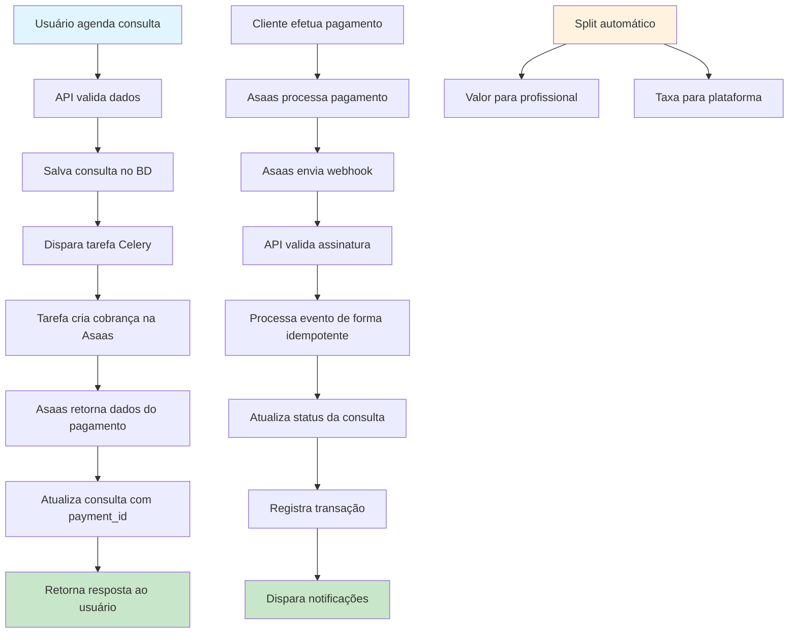

# Medical API

API RESTful para gerenciamento de profissionais da saúde e consultas médicas.

## Recursos

- Cadastro, edição, exclusão e listagem de profissionais da saúde
- Cadastro e edição de consultas médicas com vínculo ao profissional
- Busca por consultas utilizando o ID do profissional
- Segurança e validação de dados

## Tecnologias utilizadas

- Django 5.2.2
- Django REST Framework
- PostgreSQL
- Docker e Docker Compose
- Poetry para gerenciamento de dependências

## Configuração do ambiente

### Usando o script automatizado

1. Clone o repositório
2. Execute o script de configuração:

```bash
# Execução interativa com confirmações
./setup.sh

# Execução com configurações padrão (sem confirmações)
./setup.sh -y

# Mostrar opções de ajuda
./setup.sh -h
```

O script oferece duas opções de configuração:

1. **Docker (recomendado)**: Inicia os containers e configura todo o ambiente
2. **Local com Poetry**: Instala dependências e configura o ambiente local

Funcionalidades do script:

- Verifica se o arquivo `.env` existe e o cria a partir do exemplo se necessário
- Detecta automaticamente o Docker Compose V2 ou V1
- Oferece opção para resetar o banco de dados e carregar dados iniciais
- Permite criar um superusuário para acesso ao admin
- Aguarda a inicialização do banco de dados para evitar erros
- Exibe links úteis para acessar a API e o painel administrativo

O script é compatível com Docker Compose V2 (comando `docker compose`) e Docker Compose V1 (comando `docker-compose`).

### Configuração manual

1. Clone o repositório
2. Crie um arquivo `.env` baseado no `.env.example`:

```bash
cp .env.example .env
```

3. Edite o arquivo `.env` com suas configurações
4. Instale as dependências:

```bash
poetry install
```

5. Execute as migrações:

```bash
poetry run python manage.py migrate
```

6. Crie um superusuário:

```bash
poetry run python manage.py createsuperuser
```

7. Inicie o servidor:

```bash
poetry run python manage.py runserver
```

### Usando Docker Compose

1. Clone o repositório
2. Crie um arquivo `.env` baseado no `.env.example`
3. Execute:

```bash
# Para Docker Compose V2
docker compose up -d

# OU para Docker Compose V1
docker-compose up -d
```

4. Crie um superusuário para acessar o admin:

```bash
# Para Docker Compose V2
docker compose exec web python manage.py createsuperuser

# OU para Docker Compose V1
docker-compose exec web python manage.py createsuperuser
```

## Resetando o banco de dados

### Usando Docker (Recomendado)

Para resetar o banco de dados e carregar dados iniciais quando estiver usando Docker:

```bash
# Executar o script auxiliar que gerencia o processo através do Docker
./reset_docker_db.sh

# Para pular a confirmação
./reset_docker_db.sh -y

# Para ver ajuda
./reset_docker_db.sh -h
```

Este script irá:

1. Verificar se o Docker e Docker Compose estão instalados
2. Detectar automaticamente a versão do Docker Compose (V1 ou V2)
3. Verificar se os containers estão rodando e iniciá-los se necessário
4. Executar o comando de reset do banco de dados dentro do container
5. Carregar dados iniciais

O script é compatível com Docker Compose V2 (comando `docker compose`) e Docker Compose V1 (comando `docker-compose`).

### Comando direto

Se você estiver dentro do container ou configurou o ambiente manualmente:

```bash
# Comando básico
python manage.py reset_db

# Sem confirmação
python manage.py reset_db --no-input

# Sem carregar dados iniciais
python manage.py reset_db --no-seed
```

O reset do banco de dados:

1. Remove todas as tabelas
2. Recria as migrações
3. Cria um superusuário admin (senha definida em .env)
4. Cria 5 profissionais de exemplo
5. Cria 3 consultas para cada profissional

## Documentação da API

A documentação da API está disponível em:

- `/api/docs/` - Interface Swagger
- `/api/redoc/` - Interface ReDoc
- `/api/schema/` - Schema OpenAPI

## Endpoints da API

### Endpoints para Profissionais da Saúde

| Método | Endpoint | Descrição |
|--------|----------|-----------|
| GET | `/api/professionals/` | Lista todos os profissionais da saúde |
| POST | `/api/professionals/` | Cadastra um novo profissional da saúde |
| GET | `/api/professionals/{id}/` | Recupera os detalhes de um profissional específico |
| PUT | `/api/professionals/{id}/` | Atualiza completamente um profissional |
| PATCH | `/api/professionals/{id}/` | Atualiza parcialmente um profissional |
| DELETE | `/api/professionals/{id}/` | Remove um profissional do sistema |

**Exemplo de JSON para cadastro de profissional:**

```json
{
  "preferred_name": "Dr. Ana Silva",
  "profession": "Cardiologista",
  "address": "Av. Paulista, 1000 - São Paulo/SP",
  "contact": "ana.silva@email.com / (11) 98765-4321"
}
```

**Parâmetros de filtro:**

- `?search=termo` - Busca pelo nome ou profissão
- `?ordering=field` - Ordenação por campo (ex: preferred_name, -created_at para ordem decrescente)

### Endpoints para Consultas Médicas

| Método | Endpoint | Descrição |
|--------|----------|-----------|
| GET | `/api/appointments/` | Lista todas as consultas médicas |
| POST | `/api/appointments/` | Cadastra uma nova consulta médica |
| GET | `/api/appointments/{id}/` | Recupera os detalhes de uma consulta específica |
| PUT | `/api/appointments/{id}/` | Atualiza completamente uma consulta |
| PATCH | `/api/appointments/{id}/` | Atualiza parcialmente uma consulta |
| DELETE | `/api/appointments/{id}/` | Remove uma consulta do sistema |
| GET | `/api/appointments/?professional={professional_id}/` | Busca todas as consultas de um profissional específico por ID |

**Exemplo de JSON para cadastro de consulta:**

```json
{
  "date": "2025-06-15T14:30:00Z",
  "professional": 1
}
```

**Parâmetros de filtro:**

- `?professional=1` - Filtra por ID do profissional
- `?date=2025-06-15T14:30:00Z` - Filtra por data exata
- `?date_start=2025-06-01T00:00:00Z` - Filtra por data maior ou igual
- `?date_end=2025-06-30T23:59:59Z` - Filtra por data menor ou igual
- `?ordering=date` - Ordenação por data (use -date para ordem decrescente)

## Estrutura dos dados

### Profissionais

- `preferred_name` - Nome social
- `profession` - Profissão
- `address` - Endereço
- `contact` - Contato

### Consultas

- `date` - Data e hora da consulta
- `professional` - Profissional vinculado (chave estrangeira)

## Desenvolvimento

### Requisitos do sistema

- Python 3.12+
- Poetry 1.7.1+
- Docker e Docker Compose (recomendado)
- PostgreSQL (se não estiver usando Docker)

### Configuração do ambiente de desenvolvimento

Para um ambiente de desenvolvimento ideal, recomendamos usar o Docker:

```bash
# Instale o código e inicie os containers
./setup.sh

# Selecione a opção 1 (Docker)
```

### Comandos úteis para desenvolvimento

#### Com Docker

```bash
# Iniciar os containers
docker compose up -d

# Ver logs em tempo real
docker compose logs -f

# Executar comando dentro do container web
docker compose exec web python manage.py comando

# Parar os containers
docker compose down

# Parar e remover volumes (apaga dados do banco)
docker compose down -v
```

#### Sem Docker (ambiente local)

```bash
# Ativar ambiente virtual do Poetry
poetry shell

# Instalar dependências
poetry install

# Executar migrations
python manage.py migrate

# Iniciar servidor de desenvolvimento
python manage.py runserver

# Criar superusuário
python manage.py createsuperuser
```

## Solução de Problemas

### Problemas com Docker Compose

#### Comando `docker-compose` não encontrado, mas tenho Docker instalado

Se você instalou o Docker recentemente, provavelmente está usando o Docker Compose V2, que é integrado ao Docker CLI. Use:

```bash
docker compose
```

em vez de

```bash
docker-compose
```

O script `setup.sh` detecta automaticamente qual versão você está usando.

#### Erro ao conectar com o banco de dados

Verifique se:

1. O banco de dados está rodando:

```bash
docker compose ps
```

2. As configurações no arquivo `.env` correspondem às do `docker-compose.yml`

3. O container do banco de dados inicializou completamente (pode levar alguns segundos)

#### Erros de migração ou ModuleNotFoundError

Execute o script de reset do banco de dados:

```bash
./reset_docker_db.sh -y
```

#### Comando `reset_db` não encontrado

Se você receber o erro "Unknown command: 'reset_db'", verifique:

1. Se o app `core` está no `INSTALLED_APPS` (já configurado no projeto)
2. Reinicie o container web:
```bash
docker compose restart web
```
3. Verifique se os comandos estão disponíveis:
```bash
docker compose exec web python manage.py help
```

#### Problemas com permissões de arquivo

Se os scripts não executarem, verifique as permissões:

```bash
chmod +x setup.sh reset_docker_db.sh run_tests.sh
```

### Problemas com Poetry

#### Comando `poetry` não encontrado

Instale o Poetry seguindo a [documentação oficial](https://python-poetry.org/docs/#installation).

#### Dependências não instaladas corretamente

```bash
# Limpe o cache e reinstale
poetry cache clear --all pypi
poetry install --no-cache
```

## Estrutura do Projeto

A API está organizada em três aplicações Django principais:

### core

Contém configurações globais do projeto:

- `settings.py`: Configurações do Django
- `urls.py`: Roteamento principal da API
- `management/commands/reset_db.py`: Script para resetar o banco de dados

### professionals

Gerencia os profissionais da saúde:

- `models.py`: Define o modelo Professional
- `serializers.py`: Serializa dados do modelo para JSON
- `views.py`: Define o ProfessionalViewSet com filtros
- `urls.py`: Configura as rotas da API para profissionais
- `admin.py`: Configura a interface administrativa

### appointments

Gerencia as consultas médicas:

- `models.py`: Define o modelo Appointment
- `serializers.py`: Serializa dados do modelo para JSON
- `views.py`: Define o AppointmentViewSet com filtros
- `urls.py`: Configura as rotas da API para consultas
- `admin.py`: Configura a interface administrativa

### Scripts de Utilitário

- `setup.sh`: Configura o ambiente inicial
- `reset_docker_db.sh`: Reseta o banco de dados no Docker
- `run_tests.sh`: Executa os testes automaticamente
- `docker-compose.yml`: Configuração dos serviços Docker

## Testes

O projeto inclui uma suíte abrangente de testes com cobertura de 72,82%, incluindo testes de API, modelos e integração.

### Executando Testes

#### Usando o script automatizado (Recomendado)

```bash
# Script que detecta o ambiente e executa os testes apropriados
./run_tests.sh
```

O script `run_tests.sh` automaticamente:
- Detecta se o Docker está disponível e rodando
- Usa SQLite em memória para testes mais rápidos quando não está no Docker
- Executa testes no container se estiver rodando

#### Métodos manuais

**1. Django test runner com SQLite (mais rápido):**
```bash
python manage.py test --settings=core.settings.testing
```

**2. Pytest com SQLite (mais informativo):**
```bash
DJANGO_SETTINGS_MODULE=core.settings.testing pytest -v
```

**3. Testes específicos por app:**
```bash
python manage.py test appointments.tests --settings=core.settings.testing -v 2
DJANGO_SETTINGS_MODULE=core.settings.testing pytest professionals/tests.py -v
```

**4. Testes dentro do container Docker:**
```bash
docker compose exec web python manage.py test --settings=core.settings.testing
```

**5. Cobertura detalhada com pytest:**
```bash
DJANGO_SETTINGS_MODULE=core.settings.testing pytest --cov=appointments --cov=professionals --cov-report=html --cov-report=term-missing
```

**6. Testes de integração específicos:**
```bash
python manage.py test appointments.tests.AppointmentIntegrationTestCase --settings=core.settings.testing
```

### Configurações de Teste

O projeto utiliza diferentes configurações para testes:

- **`core.settings.testing`**: SQLite em memória (mais rápido, recomendado)
- **`core.settings.development`**: PostgreSQL (ambiente completo, mas requer configuração)

### Estrutura dos Testes

#### Testes de API (`appointments/tests.py`, `professionals/tests.py`)
- Testes de CRUD completo
- Validação de dados
- Filtros e ordenação
- Autenticação e permissões

#### Testes de Modelo
- Validação de campos obrigatórios
- Representação string
- Ordenação padrão
- Timestamps automáticos

#### Testes de Integração
- Relacionamentos entre modelos
- Cascade delete
- Integridade referencial

### Resultados dos Testes

- **Total de testes**: 33 testes
- **Cobertura**: 72,82% (acima do mínimo exigido de 25%)
- **Status**: ✅ Todos os testes passando
- **Tempo de execução**: ~0.2-1.2 segundos (dependendo do método)

### Relatórios de Cobertura

Os relatórios HTML de cobertura são gerados automaticamente na pasta `htmlcov/`. Abra `htmlcov/index.html` no navegador para visualizar detalhes da cobertura.

## Configurações de Ambiente

### Variáveis de Ambiente (.env)

O projeto utiliza um arquivo `.env` para configurações sensíveis:

```bash
# Segurança
SECRET_KEY=sua_chave_secreta_aqui
DEBUG=True

# Configurações do Django
DJANGO_SETTINGS_MODULE=core.settings.development

# Banco de dados
DB_NAME=medical_db
DB_USER=user
DB_PASSWORD=password
DB_HOST=db  # Para Docker, use 'localhost' para ambiente local
DB_PORT=5432

# Superusuário automático
DJANGO_SUPERUSER_PASSWORD=admin123

# Hosts permitidos
ALLOWED_HOSTS=localhost,127.0.0.1
```

### Diferentes Ambientes

O projeto suporta múltiplos ambientes:

- **`development`**: Para desenvolvimento local com PostgreSQL
- **`testing`**: Para testes com SQLite em memória
- **`production`**: Para produção (configurações de segurança aprimoradas)

## API Reference

### Status Codes

A API utiliza os seguintes códigos de status HTTP:

- `200 OK` - Requisição bem-sucedida
- `201 Created` - Recurso criado com sucesso
- `204 No Content` - Recurso deletado com sucesso
- `400 Bad Request` - Dados inválidos na requisição
- `404 Not Found` - Recurso não encontrado
- `500 Internal Server Error` - Erro interno do servidor

### Formato de Erro

```json
{
  "field_name": [
    "Mensagem de erro específica"
  ],
  "non_field_errors": [
    "Erro geral da validação"
  ]
}
```

## Performance e Otimização

### Banco de Dados

- Índices automáticos em chaves estrangeiras
- Ordenação otimizada por timestamps
- Queries eficientes com select_related para profissionais

### Cache

O projeto está preparado para implementação de cache:
- Cache de sessão configurado
- Middleware de cache disponível
- Suporte a Redis (configuração manual necessária)

## Segurança

### Configurações de Segurança

- CSRF protection habilitado
- XFrame protection ativo
- Validação de hosts permitidos
- Middleware de segurança configurado

### Variáveis Sensíveis

Todas as configurações sensíveis são gerenciadas via variáveis de ambiente:
- Chaves secretas
- Credenciais de banco de dados
- Configurações de debug

## Contribuição

### Como Contribuir

1. Fork o projeto
2. Crie uma branch para sua feature (`git checkout -b feature/AmazingFeature`)
3. Commit suas mudanças (`git commit -m 'Add some AmazingFeature'`)
4. Push para a branch (`git push origin feature/AmazingFeature`)
5. Abra um Pull Request

### Padrões de Código

- Siga o PEP 8 para Python
- Use type hints quando possível
- Mantenha cobertura de testes acima de 70%
- Documente APIs com docstrings
- Escreva testes para novas funcionalidades

### Executando Testes Antes de Contribuir

```bash
# Execute todos os testes
./run_tests.sh

# Verifique a cobertura
DJANGO_SETTINGS_MODULE=core.settings.testing pytest --cov=. --cov-report=term-missing

# Verifique a formatação do código
poetry run black --check .
poetry run flake8 .
```

## Licença

Este projeto está licenciado sob a MIT License - veja o arquivo [LICENSE](LICENSE) para detalhes.

## Contato

Para dúvidas ou sugestões sobre o projeto, abra uma issue no GitHub.

## Verificação Rápida

Após a instalação, você pode verificar se tudo está funcionando:

### 1. Verificar se a API está respondendo
```bash
curl http://localhost:8000/api/docs/
```

### 2. Testar endpoints da API
```bash
# Listar profissionais
curl http://localhost:8000/api/professionals/

# Listar consultas
curl http://localhost:8000/api/appointments/
```

### 3. Executar os testes
```bash
./run_tests.sh
```

### 4. Acessar o admin
Vá para http://localhost:8000/admin/ e faça login com:
- Usuário: `admin`
- Senha: `admin123` (ou a definida em `.env`)

## Changelog

### v1.0.0
- ✅ CRUD completo para profissionais da saúde
- ✅ CRUD completo para consultas médicas
- ✅ Filtros e busca avançada
- ✅ Documentação OpenAPI/Swagger
- ✅ Testes abrangentes (72,82% cobertura)
- ✅ Scripts de automação (setup, reset, testes)
- ✅ Suporte completo ao Docker
- ✅ Configurações multi-ambiente

## Roadmap

### v1.1.0 (Planejado)
- [ ] Autenticação e autorização
- [ ] Sistema de notificações
- [ ] API de relatórios
- [ ] Cache com Redis
- [ ] Logs estruturados

### v1.2.0 (Planejado)
- [ ] Interface web (frontend)
- [ ] Integração com calendários
- [ ] Backup automático
- [ ] Métricas e monitoramento

# 💳 Integração com Asaas - Proposta de Implementação Robusta

Este documento detalha a arquitetura proposta para integrar a plataforma com o sistema de pagamentos [Asaas](https://www.asaas.com/), implementando um sistema robusto de split de pagamentos entre profissionais da saúde e a plataforma.

---

## 🎯 Visão Geral

A integração proposta visa automatizar completamente o processo de cobrança de consultas médicas, implementando um sistema de split de pagamento que garante:

- **Transparência**: Divisão clara de valores entre profissional e plataforma
- **Segurança**: Validação robusta de pagamentos e transações
- **Escalabilidade**: Arquitetura preparada para alto volume de transações
- **Confiabilidade**: Sistema tolerante a falhas com retry automático
- **Rastreabilidade**: Log completo de todas as operações financeiras

### Benefícios da Implementação

✅ **Automatização completa** do processo de cobrança  
✅ **Redução de custos** operacionais  
✅ **Experiência do usuário** aprimorada  
✅ **Compliance** com regulamentações financeiras  
✅ **Escalabilidade** para crescimento da plataforma  
✅ **Monitoramento** em tempo real dos pagamentos

---

## 📌 Objetivos Específicos

### Objetivo Principal
Automatizar o processo de cobrança de consultas e implementar o repasse proporcional de valores entre os profissionais e a plataforma de forma transparente, segura e rastreável.

### Objetivos Secundários
- **Reduzir a carga operacional** de processamento manual de pagamentos
- **Garantir conformidade** com regulamentações do setor financeiro
- **Implementar auditoria completa** de todas as transações
- **Otimizar o fluxo de caixa** com liquidação automática
- **Minimizar disputas** através de transparência nos repasses

---

## 🏛️ Arquitetura e Princípios de Design

A integração será baseada em cinco pilares fundamentais para garantir a resiliência e escalabilidade do sistema:

### 1. **Separação de Responsabilidades (SRP)**
- A lógica de comunicação com a API da Asaas será encapsulada em uma camada de serviço dedicada
- Novo app `payments` responsável exclusivamente pela integração financeira
- Isolamento claro entre regras de negócio e integração externa

### 2. **Processamento Assíncrono**
- Chamadas para APIs externas executadas em background via Celery
- Interface do usuário permanece responsiva durante processamento
- Sistema de retry automático com backoff exponencial
- Monitoramento de performance das tarefas assíncronas

### 3. **Consistência e Atomicidade**
- Uso de sinais do Django para automação de processos
- Transações atômicas garantem integridade dos dados
- Padrão Saga para operações distribuídas
- Idempotência em todas as operações críticas

### 4. **Observabilidade e Monitoramento**
- Logs estruturados para auditoria completa
- Métricas de performance e disponibilidade
- Alertas para falhas críticas
- Dashboard de monitoramento financeiro

### 5. **Segurança por Design**
- Validação rigorosa de webhooks
- Criptografia de dados sensíveis
- Controle de acesso baseado em roles
- Auditoria de todas as operações financeiras

---

## 💰 Modelo de Split de Pagamento

### Configuração de Repasse
```python
# Exemplo de configuração flexível
SPLIT_CONFIG = {
    'platform_percentage': 15.0,  # 15% para a plataforma
    'professional_percentage': 85.0,  # 85% para o profissional
    'minimum_split_amount': 10.00,  # Valor mínimo para split
    'platform_wallet_id': 'wallet_platform_123'
}
```

### Cálculo Automático
- **Taxa da plataforma**: Configurável por categoria de profissional
- **Repasse profissional**: Valor líquido após taxas
- **Taxas Asaas**: Descontadas automaticamente
- **Impostos**: Calculados conforme legislação vigente

---

## 🧩 Componentes da Integração

## 🧩 Componentes da Integração

### 1. Modelos de Dados Estendidos

Para suportar a integração completa, os modelos serão estendidos com campos específicos para rastreamento e controle:

**`professionals/models.py`**
```python
class Professional(models.Model):
    # ... campos existentes ...
    
    # Dados de integração Asaas
    email = models.EmailField(unique=True)  # Obrigatório para Asaas
    phone = models.CharField(max_length=15, blank=True)  # Para notificações
    asaas_customer_id = models.CharField(
        "ID de Cliente Asaas", 
        max_length=255, 
        blank=True, 
        null=True, 
        unique=True,
        db_index=True
    )
    asaas_wallet_id = models.CharField(
        "ID da Carteira Asaas", 
        max_length=255, 
        blank=True, 
        null=True,
        db_index=True
    )
    
    # Configurações de split
    split_percentage = models.DecimalField(
        "Percentual do Profissional",
        max_digits=5,
        decimal_places=2,
        default=85.00,
        help_text="Percentual que o profissional recebe (ex: 85.00 para 85%)"
    )
    
    # Status da integração
    integration_status = models.CharField(
        max_length=20,
        choices=[
            ('PENDING', 'Integração Pendente'),
            ('ACTIVE', 'Integração Ativa'),
            ('ERROR', 'Erro na Integração'),
            ('SUSPENDED', 'Integração Suspensa'),
        ],
        default='PENDING'
    )
    integration_error = models.TextField(blank=True, help_text="Último erro de integração")
    
    # Timestamps
    asaas_created_at = models.DateTimeField(null=True, blank=True)
    asaas_updated_at = models.DateTimeField(null=True, blank=True)
```

**`appointments/models.py`**
```python
class Appointment(models.Model):
    # ... campos existentes ...
    
    # Status do pagamento
    STATUS_CHOICES = [
        ('PENDING', 'Aguardando Pagamento'),
        ('PROCESSING', 'Processando Pagamento'),
        ('PAID', 'Pago'),
        ('CANCELED', 'Cancelado'),
        ('REFUNDED', 'Reembolsado'),
        ('FAILED', 'Falha no Pagamento'),
    ]
    status = models.CharField(max_length=20, choices=STATUS_CHOICES, default='PENDING')
    
    # Dados financeiros
    total_amount = models.DecimalField(
        "Valor Total",
        max_digits=10,
        decimal_places=2,
        help_text="Valor total da consulta"
    )
    platform_amount = models.DecimalField(
        "Valor da Plataforma",
        max_digits=10,
        decimal_places=2,
        null=True,
        blank=True
    )
    professional_amount = models.DecimalField(
        "Valor do Profissional",
        max_digits=10,
        decimal_places=2,
        null=True,
        blank=True
    )
    
    # Integração Asaas
    asaas_payment_id = models.CharField(
        "ID do Pagamento Asaas",
        max_length=255,
        blank=True,
        null=True,
        unique=True,
        db_index=True
    )
    asaas_invoice_url = models.URLField(blank=True, help_text="URL da fatura Asaas")
    
    # Metadados do pagamento
    payment_method = models.CharField(
        max_length=20,
        choices=[
            ('BOLETO', 'Boleto Bancário'),
            ('CREDIT_CARD', 'Cartão de Crédito'),
            ('DEBIT_CARD', 'Cartão de Débito'),
            ('PIX', 'PIX'),
            ('BANK_SLIP', 'Transferência Bancária'),
        ],
        blank=True
    )
    due_date = models.DateField(null=True, blank=True, help_text="Data de vencimento")
    paid_at = models.DateTimeField(null=True, blank=True)
    
    # Auditoria
    payment_attempts = models.PositiveIntegerField(default=0)
    last_payment_error = models.TextField(blank=True)
    
    class Meta:
        # ... meta existente ...
        indexes = [
            models.Index(fields=['status', 'created_at']),
            models.Index(fields=['asaas_payment_id']),
        ]
```

**`payments/models.py`** (Novo modelo)
```python
class PaymentTransaction(models.Model):
    """Modelo para rastreamento completo de transações"""
    
    TRANSACTION_TYPES = [
        ('CHARGE', 'Cobrança'),
        ('SPLIT', 'Divisão de Pagamento'),
        ('REFUND', 'Reembolso'),
        ('CHARGEBACK', 'Chargeback'),
    ]
    
    STATUS_CHOICES = [
        ('PENDING', 'Pendente'),
        ('PROCESSING', 'Processando'),
        ('COMPLETED', 'Concluída'),
        ('FAILED', 'Falhou'),
        ('CANCELED', 'Cancelada'),
    ]
    
    # Relacionamentos
    appointment = models.ForeignKey('appointments.Appointment', on_delete=models.PROTECT)
    professional = models.ForeignKey('professionals.Professional', on_delete=models.PROTECT)
    
    # Dados da transação
    transaction_type = models.CharField(max_length=20, choices=TRANSACTION_TYPES)
    status = models.CharField(max_length=20, choices=STATUS_CHOICES, default='PENDING')
    amount = models.DecimalField(max_digits=10, decimal_places=2)
    
    # IDs externos
    asaas_transaction_id = models.CharField(max_length=255, unique=True, db_index=True)
    asaas_charge_id = models.CharField(max_length=255, blank=True)
    
    # Metadados
    request_data = models.JSONField(default=dict, help_text="Dados enviados para Asaas")
    response_data = models.JSONField(default=dict, help_text="Resposta da Asaas")
    error_details = models.TextField(blank=True)
    
    # Timestamps
    created_at = models.DateTimeField(auto_now_add=True)
    updated_at = models.DateTimeField(auto_now=True)
    processed_at = models.DateTimeField(null=True, blank=True)
    
    class Meta:
        ordering = ['-created_at']
        indexes = [
            models.Index(fields=['status', 'created_at']),
            models.Index(fields=['asaas_transaction_id']),
            models.Index(fields=['appointment', 'transaction_type']),
        ]
```
### 2. Camada de Serviços Asaas

**`payments/services/asaas_service.py`**
```python
import requests
import logging
from typing import Optional, Dict, Any
from django.conf import settings
from django.core.cache import cache
from .exceptions import AsaasAPIException, AsaasTimeoutException

logger = logging.getLogger('payments.asaas')

class AsaasService:
    """Serviço para integração com API da Asaas"""
    
    def __init__(self):
        self.base_url = settings.ASAAS_API_URL
        self.api_key = settings.ASAAS_API_KEY
        self.timeout = 30
        
    def _make_request(self, method: str, endpoint: str, data: Optional[Dict] = None, 
                     retry_count: int = 0) -> Dict[str, Any]:
        """Executa requisição para API da Asaas com retry e logging"""
        
        url = f"{self.base_url}/{endpoint}"
        headers = {
            'access_token': self.api_key,
            'Content-Type': 'application/json',
            'User-Agent': 'MedicalAPI/1.0'
        }
        
        try:
            logger.info(f"Asaas API Request: {method} {endpoint}", extra={
                'method': method,
                'endpoint': endpoint,
                'data': data,
                'retry_count': retry_count
            })
            
            response = requests.request(
                method=method,
                url=url,
                json=data,
                headers=headers,
                timeout=self.timeout
            )
            
            # Log da resposta
            logger.info(f"Asaas API Response: {response.status_code}", extra={
                'status_code': response.status_code,
                'response_data': response.json() if response.content else None
            })
            
            response.raise_for_status()
            return response.json()
            
        except requests.exceptions.Timeout:
            raise AsaasTimeoutException(f"Timeout na requisição para {endpoint}")
        except requests.exceptions.RequestException as e:
            if retry_count < 2:  # Máximo 3 tentativas
                logger.warning(f"Erro na requisição Asaas, tentativa {retry_count + 1}: {e}")
                return self._make_request(method, endpoint, data, retry_count + 1)
            else:
                logger.error(f"Falha definitiva na requisição Asaas: {e}")
                raise AsaasAPIException(f"Erro na API Asaas: {e}")
    
    def create_customer(self, name: str, email: str, phone: str = None, 
                       cpf_cnpj: str = None) -> Dict[str, Any]:
        """Cria um cliente na Asaas"""
        
        data = {
            'name': name,
            'email': email
        }
        
        if phone:
            data['phone'] = phone
        if cpf_cnpj:
            data['cpfCnpj'] = cpf_cnpj
            
        return self._make_request('POST', 'customers', data)
    
    def create_charge_with_split(self, customer_id: str, total_value: float,
                               professional_wallet_id: str, platform_percentage: float = 15.0,
                               due_date: str = None, description: str = None) -> Dict[str, Any]:
        """Cria cobrança com split de pagamento"""
        
        platform_amount = round(total_value * (platform_percentage / 100), 2)
        professional_amount = round(total_value - platform_amount, 2)
        
        data = {
            'customer': customer_id,
            'billingType': 'BOLETO',  # Configurável
            'value': total_value,
            'dueDate': due_date,
            'description': description or f'Consulta médica - Valor: R$ {total_value}',
            'split': [
                {
                    'walletId': professional_wallet_id,
                    'fixedValue': professional_amount,
                    'description': f'Repasse profissional - {100 - platform_percentage}%'
                }
            ],
            'callback': {
                'successUrl': f"{settings.FRONTEND_URL}/payment/success",
                'autoRedirect': True
            },
            'discount': {
                'value': 0,
                'dueDateLimitDays': 0
            },
            'fine': {
                'value': 2.0
            },
            'interest': {
                'value': 1.0
            }
        }
        
        return self._make_request('POST', 'payments', data)
    
    def get_payment_status(self, payment_id: str) -> Dict[str, Any]:
        """Consulta status de um pagamento"""
        return self._make_request('GET', f'payments/{payment_id}')
    
    def cancel_payment(self, payment_id: str) -> Dict[str, Any]:
        """Cancela um pagamento"""
        return self._make_request('DELETE', f'payments/{payment_id}')
    
    def refund_payment(self, payment_id: str, amount: float = None) -> Dict[str, Any]:
        """Processa reembolso"""
        data = {}
        if amount:
            data['value'] = amount
            
        return self._make_request('POST', f'payments/{payment_id}/refund', data)
```

**`payments/services/exceptions.py`**
```python
class AsaasException(Exception):
    """Exceção base para erros da Asaas"""
    pass

class AsaasAPIException(AsaasException):
    """Erro na API da Asaas"""
    pass

class AsaasTimeoutException(AsaasException):
    """Timeout na comunicação com Asaas"""
    pass

class AsaasValidationException(AsaasException):
    """Erro de validação nos dados enviados"""
    pass
```
### 3. Automação com Sinais do Django

**`professionals/signals.py`**
```python
import logging
from django.db.models.signals import post_save
from django.dispatch import receiver
from django.db import transaction
from .models import Professional
from payments.services.asaas_service import AsaasService
from payments.tasks import create_asaas_customer_task

logger = logging.getLogger('professionals.signals')

@receiver(post_save, sender=Professional)
def handle_professional_creation(sender, instance, created, **kwargs):
    """
    Sinal para automatizar criação de cliente Asaas quando profissional é cadastrado
    """
    if created and not instance.asaas_customer_id:
        logger.info(f"Novo profissional criado: {instance.preferred_name} (ID: {instance.id})")
        
        # Agenda tarefa assíncrona para criação na Asaas
        transaction.on_commit(
            lambda: create_asaas_customer_task.delay(instance.id)
        )

@receiver(post_save, sender=Professional)
def handle_professional_update(sender, instance, created, **kwargs):
    """
    Sinal para sincronizar alterações do profissional com Asaas
    """
    if not created and instance.asaas_customer_id:
        # Verifica se campos relevantes foram alterados
        relevant_fields = ['preferred_name', 'email', 'phone']
        
        if any(field in kwargs.get('update_fields', []) for field in relevant_fields):
            logger.info(f"Profissional atualizado: {instance.preferred_name} (ID: {instance.id})")
            
            # Agenda sincronização com Asaas
            transaction.on_commit(
                lambda: sync_professional_with_asaas_task.delay(instance.id)
            )
```
### 4. Tarefas Assíncronas com Celery

**`payments/tasks.py`**
```python
import logging
from celery import shared_task
from celery.exceptions import Retry
from django.db import transaction
from django.utils import timezone
from .services.asaas_service import AsaasService, AsaasAPIException
from .models import PaymentTransaction
from appointments.models import Appointment
from professionals.models import Professional

logger = logging.getLogger('payments.tasks')

@shared_task(bind=True, max_retries=5, default_retry_delay=60)
def create_asaas_customer_task(self, professional_id):
    """Cria cliente na Asaas para um profissional"""
    
    try:
        professional = Professional.objects.get(id=professional_id)
        
        if professional.asaas_customer_id:
            logger.info(f"Profissional {professional_id} já possui customer_id")
            return {'status': 'already_exists', 'customer_id': professional.asaas_customer_id}
        
        asaas_service = AsaasService()
        
        # Cria cliente na Asaas
        customer_data = asaas_service.create_customer(
            name=professional.preferred_name,
            email=professional.email,
            phone=getattr(professional, 'phone', None)
        )
        
        # Atualiza profissional com dados da Asaas
        with transaction.atomic():
            professional.asaas_customer_id = customer_data.get('id')
            professional.integration_status = 'ACTIVE'
            professional.asaas_created_at = timezone.now()
            professional.integration_error = ''
            professional.save(update_fields=[
                'asaas_customer_id', 'integration_status', 
                'asaas_created_at', 'integration_error'
            ])
        
        logger.info(f"Cliente Asaas criado para profissional {professional_id}: {customer_data.get('id')}")
        
        return {
            'status': 'created',
            'customer_id': customer_data.get('id'),
            'professional_id': professional_id
        }
        
    except Professional.DoesNotExist:
        logger.error(f"Profissional {professional_id} não encontrado")
        return {'status': 'error', 'message': 'Professional not found'}
        
    except AsaasAPIException as exc:
        logger.error(f"Erro API Asaas ao criar cliente para profissional {professional_id}: {exc}")
        
        # Atualiza status de erro
        try:
            professional = Professional.objects.get(id=professional_id)
            professional.integration_status = 'ERROR'
            professional.integration_error = str(exc)
            professional.save(update_fields=['integration_status', 'integration_error'])
        except Professional.DoesNotExist:
            pass
        
        # Retry com backoff exponencial
        raise self.retry(exc=exc, countdown=60 * (2 ** self.request.retries))

@shared_task(bind=True, max_retries=3, default_retry_delay=30)
def create_asaas_charge_task(self, appointment_id, total_value, due_date=None):
    """Cria cobrança na Asaas com split de pagamento"""
    
    try:
        appointment = Appointment.objects.select_related('professional').get(id=appointment_id)
        
        if appointment.asaas_payment_id:
            logger.warning(f"Consulta {appointment_id} já possui payment_id")
            return {'status': 'already_exists', 'payment_id': appointment.asaas_payment_id}
        
        if not appointment.professional.asaas_customer_id:
            logger.error(f"Profissional {appointment.professional.id} não possui customer_id")
            raise Exception("Professional não possui integração com Asaas")
        
        asaas_service = AsaasService()
        
        # Calcula split baseado na configuração do profissional
        platform_percentage = 100 - float(appointment.professional.split_percentage)
        
        # Cria transação de cobrança
        with transaction.atomic():
            payment_transaction = PaymentTransaction.objects.create(
                appointment=appointment,
                professional=appointment.professional,
                transaction_type='CHARGE',
                status='PROCESSING',
                amount=total_value,
                request_data={
                    'total_value': total_value,
                    'platform_percentage': platform_percentage,
                    'due_date': due_date
                }
            )
            
            # Cria cobrança na Asaas
            charge_data = asaas_service.create_charge_with_split(
                customer_id=appointment.professional.asaas_customer_id,
                total_value=float(total_value),
                professional_wallet_id=appointment.professional.asaas_wallet_id,
                platform_percentage=platform_percentage,
                due_date=due_date,
                description=f"Consulta médica - {appointment.professional.preferred_name}"
            )
            
            # Atualiza registros com dados da Asaas
            appointment.asaas_payment_id = charge_data.get('id')
            appointment.asaas_invoice_url = charge_data.get('invoiceUrl')
            appointment.status = 'PROCESSING'
            appointment.total_amount = total_value
            appointment.platform_amount = round(total_value * (platform_percentage / 100), 2)
            appointment.professional_amount = total_value - appointment.platform_amount
            appointment.due_date = due_date
            appointment.save()
            
            payment_transaction.asaas_transaction_id = charge_data.get('id')
            payment_transaction.asaas_charge_id = charge_data.get('id')
            payment_transaction.status = 'COMPLETED'
            payment_transaction.response_data = charge_data
            payment_transaction.processed_at = timezone.now()
            payment_transaction.save()
        
        logger.info(f"Cobrança criada para consulta {appointment_id}: {charge_data.get('id')}")
        
        return {
            'status': 'created',
            'payment_id': charge_data.get('id'),
            'invoice_url': charge_data.get('invoiceUrl'),
            'appointment_id': appointment_id
        }
        
    except Appointment.DoesNotExist:
        logger.error(f"Consulta {appointment_id} não encontrada")
        return {'status': 'error', 'message': 'Appointment not found'}
        
    except Exception as exc:
        logger.error(f"Erro ao criar cobrança para consulta {appointment_id}: {exc}")
        
        # Atualiza status de erro na consulta
        try:
            appointment = Appointment.objects.get(id=appointment_id)
            appointment.status = 'FAILED'
            appointment.last_payment_error = str(exc)
            appointment.payment_attempts += 1
            appointment.save(update_fields=['status', 'last_payment_error', 'payment_attempts'])
        except Appointment.DoesNotExist:
            pass
        
        # Retry se não excedeu tentativas
        if self.request.retries < self.max_retries:
            raise self.retry(exc=exc, countdown=30 * (2 ** self.request.retries))
        else:
            # Falha definitiva
            logger.error(f"Falha definitiva ao criar cobrança para consulta {appointment_id}")
            return {'status': 'failed', 'message': str(exc)}

@shared_task(bind=True, max_retries=3)
def sync_payment_status_task(self, payment_id):
    """Sincroniza status de pagamento com Asaas"""
    
    try:
        appointment = Appointment.objects.get(asaas_payment_id=payment_id)
        asaas_service = AsaasService()
        
        # Consulta status na Asaas
        payment_data = asaas_service.get_payment_status(payment_id)
        
        # Mapeia status Asaas para nosso sistema
        status_mapping = {
            'PENDING': 'PENDING',
            'RECEIVED': 'PAID',
            'CONFIRMED': 'PAID',
            'OVERDUE': 'PENDING',
            'REFUNDED': 'REFUNDED',
            'RECEIVED_IN_CASH': 'PAID',
            'REFUND_REQUESTED': 'REFUNDED',
            'CHARGEBACK_REQUESTED': 'CANCELED',
            'CHARGEBACK_DISPUTE': 'CANCELED',
            'AWAITING_CHARGEBACK_REVERSAL': 'CANCELED',
            'DUNNING_REQUESTED': 'CANCELED',
            'DUNNING_RECEIVED': 'CANCELED',
            'AWAITING_RISK_ANALYSIS': 'PROCESSING',
        }
        
        new_status = status_mapping.get(payment_data.get('status'), 'PENDING')
        
        if appointment.status != new_status:
            with transaction.atomic():
                old_status = appointment.status
                appointment.status = new_status
                
                if new_status == 'PAID':
                    appointment.paid_at = timezone.now()
                
                appointment.save(update_fields=['status', 'paid_at'])
                
                logger.info(f"Status da consulta {appointment.id} atualizado: {old_status} -> {new_status}")
        
        return {
            'status': 'updated',
            'appointment_id': appointment.id,
            'old_status': appointment.status,
            'new_status': new_status
        }
        
    except Appointment.DoesNotExist:
        logger.error(f"Consulta com payment_id {payment_id} não encontrada")
        return {'status': 'error', 'message': 'Appointment not found'}
        
    except Exception as exc:
        logger.error(f"Erro ao sincronizar status do pagamento {payment_id}: {exc}")
        raise self.retry(exc=exc, countdown=60)
```
### 5. Integração nas Views da API

**`appointments/views.py`**
```python
from decimal import Decimal
from django.db import transaction
from rest_framework import status
from rest_framework.decorators import action
from rest_framework.response import Response
from payments.tasks import create_asaas_charge_task
import logging

logger = logging.getLogger('appointments.views')

class AppointmentViewSet(viewsets.ModelViewSet):
    # ... código existente ...
    
    def perform_create(self, serializer):
        """Cria consulta e inicia processo de cobrança"""
        
        # Validações de negócio
        total_value = serializer.validated_data.get('total_amount')
        if not total_value or total_value <= 0:
            raise ValidationError({"total_amount": "Valor da consulta deve ser maior que zero"})
        
        professional = serializer.validated_data.get('professional')
        if professional.integration_status != 'ACTIVE':
            raise ValidationError({
                "professional": "Profissional não possui integração ativa com sistema de pagamentos"
            })
        
        with transaction.atomic():
            # 1. Salva a consulta
            appointment = serializer.save(status='PENDING')
            
            # 2. Agenda criação da cobrança após commit
            transaction.on_commit(
                lambda: create_asaas_charge_task.delay(
                    appointment.id,
                    float(total_value),
                    appointment.due_date.isoformat() if appointment.due_date else None
                )
            )
            
            logger.info(f"Consulta criada: {appointment.id}, valor: R$ {total_value}")
    
    @action(detail=True, methods=['post'])
    def cancel_payment(self, request, pk=None):
        """Cancela pagamento de uma consulta"""
        
        appointment = self.get_object()
        
        if not appointment.asaas_payment_id:
            return Response(
                {"detail": "Consulta não possui pagamento para cancelar"},
                status=status.HTTP_400_BAD_REQUEST
            )
        
        if appointment.status in ['PAID', 'REFUNDED']:
            return Response(
                {"detail": "Não é possível cancelar pagamento já processado"},
                status=status.HTTP_400_BAD_REQUEST
            )
        
        # Agenda cancelamento
        from payments.tasks import cancel_asaas_payment_task
        cancel_asaas_payment_task.delay(appointment.asaas_payment_id)
        
        return Response({"detail": "Cancelamento iniciado"})
    
    @action(detail=True, methods=['get'])
    def payment_status(self, request, pk=None):
        """Consulta status atualizado do pagamento"""
        
        appointment = self.get_object()
        
        if not appointment.asaas_payment_id:
            return Response({"status": "NO_PAYMENT"})
        
        # Agenda sincronização
        from payments.tasks import sync_payment_status_task
        sync_payment_status_task.delay(appointment.asaas_payment_id)
        
        return Response({
            "status": appointment.status,
            "payment_id": appointment.asaas_payment_id,
            "invoice_url": appointment.asaas_invoice_url,
            "total_amount": appointment.total_amount,
            "platform_amount": appointment.platform_amount,
            "professional_amount": appointment.professional_amount,
            "paid_at": appointment.paid_at
        })
```


### 6. Sistema de Webhooks Robusto

**`payments/views.py`**
```python
import hashlib
import hmac
import json
import logging
from django.conf import settings
from django.db import transaction
from django.http import HttpResponse
from django.utils import timezone
from django.views.decorators.csrf import csrf_exempt
from django.views.decorators.http import require_http_methods
from rest_framework.decorators import api_view, permission_classes
from rest_framework.permissions import AllowAny
from rest_framework.response import Response
from appointments.models import Appointment
from .models import PaymentTransaction

logger = logging.getLogger('payments.webhooks')

def verify_webhook_signature(request):
    """Verifica assinatura do webhook para garantir autenticidade"""
    
    signature = request.headers.get('X-Asaas-Signature')
    if not signature:
        return False
    
    # Calcula hash esperado
    secret = settings.ASAAS_WEBHOOK_SECRET
    payload = request.body
    expected_signature = hmac.new(
        secret.encode('utf-8'),
        payload,
        hashlib.sha256
    ).hexdigest()
    
    return hmac.compare_digest(signature, expected_signature)

@csrf_exempt
@require_http_methods(["POST"])
def asaas_webhook_receiver(request):
    """
    Endpoint para receber webhooks da Asaas
    Implementa idempotência e processamento seguro
    """
    
    # Log da requisição recebida
    logger.info("Webhook recebido da Asaas", extra={
        'headers': dict(request.headers),
        'body_size': len(request.body)
    })
    
    # 1. Verificação de segurança
    if not verify_webhook_signature(request):
        logger.warning("Webhook rejeitado: assinatura inválida")
        return HttpResponse(status=401)
    
    try:
        # 2. Parse do payload
        webhook_data = json.loads(request.body)
        event_type = webhook_data.get('event')
        payment_data = webhook_data.get('payment', {})
        payment_id = payment_data.get('id')
        
        if not payment_id or not event_type:
            logger.warning("Webhook rejeitado: dados incompletos")
            return HttpResponse(status=400)
        
        # 3. Processamento idempotente
        with transaction.atomic():
            # Verifica se já processamos este evento
            webhook_id = webhook_data.get('id')
            if webhook_id:
                # Implementar tabela de webhooks processados se necessário
                pass
            
            result = process_payment_event(payment_id, event_type, payment_data, webhook_data)
            
            logger.info(f"Webhook processado: {event_type} para payment {payment_id}", extra={
                'event_type': event_type,
                'payment_id': payment_id,
                'result': result
            })
        
        return HttpResponse(status=200)
        
    except json.JSONDecodeError:
        logger.error("Webhook rejeitado: JSON inválido")
        return HttpResponse(status=400)
    except Exception as e:
        logger.error(f"Erro ao processar webhook: {e}", exc_info=True)
        return HttpResponse(status=500)

def process_payment_event(payment_id, event_type, payment_data, webhook_data):
    """
    Processa eventos de pagamento de forma idempotente
    """
    
    try:
        appointment = Appointment.objects.select_related('professional').get(
            asaas_payment_id=payment_id
        )
    except Appointment.DoesNotExist:
        logger.warning(f"Appointment não encontrado para payment_id: {payment_id}")
        return {'status': 'not_found'}
    
    # Mapeamento de eventos para status
    event_status_mapping = {
        'PAYMENT_RECEIVED': 'PAID',
        'PAYMENT_CONFIRMED': 'PAID',
        'PAYMENT_OVERDUE': 'PENDING',
        'PAYMENT_DELETED': 'CANCELED',
        'PAYMENT_REFUNDED': 'REFUNDED',
        'PAYMENT_RECEIVED_IN_CASH': 'PAID',
        'PAYMENT_CHARGEBACK_REQUESTED': 'CANCELED',
        'PAYMENT_AWAITING_RISK_ANALYSIS': 'PROCESSING',
    }
    
    new_status = event_status_mapping.get(event_type)
    if not new_status:
        logger.info(f"Evento não mapeado: {event_type}")
        return {'status': 'ignored', 'event': event_type}
    
    # Verifica se precisa atualizar (idempotência)
    if appointment.status == new_status:
        logger.info(f"Status já atualizado para {new_status}, ignorando")
        return {'status': 'already_updated'}
    
    # Validações de transição de status
    valid_transitions = {
        'PENDING': ['PROCESSING', 'PAID', 'CANCELED', 'FAILED'],
        'PROCESSING': ['PAID', 'CANCELED', 'FAILED'],
        'PAID': ['REFUNDED'],
        'CANCELED': [],
        'REFUNDED': [],
        'FAILED': ['PENDING', 'PROCESSING']
    }
    
    if new_status not in valid_transitions.get(appointment.status, []):
        logger.warning(f"Transição inválida: {appointment.status} -> {new_status}")
        return {'status': 'invalid_transition'}
    
    # Atualiza status
    old_status = appointment.status
    appointment.status = new_status
    
    # Campos específicos por evento
    if event_type in ['PAYMENT_RECEIVED', 'PAYMENT_CONFIRMED', 'PAYMENT_RECEIVED_IN_CASH']:
        appointment.paid_at = timezone.now()
        
        # Atualiza método de pagamento se disponível
        billing_type = payment_data.get('billingType')
        if billing_type:
            method_mapping = {
                'BOLETO': 'BOLETO',
                'CREDIT_CARD': 'CREDIT_CARD',
                'DEBIT_CARD': 'DEBIT_CARD',
                'PIX': 'PIX',
                'BANK_SLIP': 'BANK_SLIP'
            }
            appointment.payment_method = method_mapping.get(billing_type, billing_type)
    
    appointment.save(update_fields=['status', 'paid_at', 'payment_method'])
    
    # Registra transação
    PaymentTransaction.objects.create(
        appointment=appointment,
        professional=appointment.professional,
        transaction_type='WEBHOOK',
        status='COMPLETED',
        amount=appointment.total_amount or 0,
        asaas_transaction_id=f"webhook_{payment_id}_{timezone.now().timestamp()}",
        request_data=webhook_data,
        response_data={'status_updated': f"{old_status} -> {new_status}"},
        processed_at=timezone.now()
    )
    
    # Triggers pós-processamento
    post_process_payment_event(appointment, event_type, old_status, new_status)
    
    return {
        'status': 'updated',
        'old_status': old_status,
        'new_status': new_status,
        'appointment_id': appointment.id
    }

def post_process_payment_event(appointment, event_type, old_status, new_status):
    """
    Processa ações pós-evento (notificações, emails, etc.)
    """
    
    # Enviar notificações
    if new_status == 'PAID':
        # Notificar profissional sobre pagamento recebido
        from payments.tasks import send_payment_confirmation_task
        send_payment_confirmation_task.delay(appointment.id)
        
    elif new_status == 'CANCELED':
        # Notificar sobre cancelamento
        from payments.tasks import send_payment_cancellation_task
        send_payment_cancellation_task.delay(appointment.id)
        
    elif new_status == 'REFUNDED':
        # Processar reembolso
        from payments.tasks import process_refund_task
        process_refund_task.delay(appointment.id)
```

---

## 🔒 Segurança e Compliance

### Configurações de Segurança

**`settings/security.py`**
```python
# Configurações específicas para pagamentos
ASAAS_API_URL = env('ASAAS_API_URL', default='https://www.asaas.com/api/v3')
ASAAS_API_KEY = env('ASAAS_API_KEY')  # Obrigatório
ASAAS_WEBHOOK_TOKEN = env('ASAAS_WEBHOOK_TOKEN')  # Token de validação
ASAAS_WEBHOOK_SECRET = env('ASAAS_WEBHOOK_SECRET')  # Chave para assinatura

# Timeouts e limites
ASAAS_REQUEST_TIMEOUT = 30
ASAAS_MAX_RETRIES = 3
ASAAS_RETRY_DELAY = 60

# Configurações de audit log
AUDIT_LOG_PAYMENTS = True
AUDIT_LOG_RETENTION_DAYS = 2555  # 7 anos para compliance
```

### Validações e Sanitização

```python
from decimal import Decimal, InvalidOperation
from django.core.exceptions import ValidationError

def validate_payment_amount(amount):
    """Valida valor de pagamento"""
    try:
        decimal_amount = Decimal(str(amount))
        if decimal_amount <= 0:
            raise ValidationError("Valor deve ser maior que zero")
        if decimal_amount > Decimal('999999.99'):
            raise ValidationError("Valor excede limite máximo")
        return decimal_amount
    except (InvalidOperation, TypeError):
        raise ValidationError("Valor inválido")

def sanitize_customer_data(data):
    """Sanitiza dados do cliente antes de enviar para Asaas"""
    
    import re
    
    sanitized = {}
    
    # Nome: apenas letras, espaços e acentos
    if 'name' in data:
        sanitized['name'] = re.sub(r'[^a-zA-ZÀ-ÿ\s]', '', data['name']).strip()
    
    # Email: validação básica
    if 'email' in data:
        email = data['email'].lower().strip()
        if re.match(r'^[^@]+@[^@]+\.[^@]+$', email):
            sanitized['email'] = email
    
    # Telefone: apenas números
    if 'phone' in data:
        phone = re.sub(r'[^\d]', '', data['phone'])
        if len(phone) >= 10:
            sanitized['phone'] = phone
    
    return sanitized
```

---

## 📊 Monitoramento e Observabilidade

### Métricas Customizadas

**`payments/metrics.py`**
```python
from django.core.cache import cache
from django.db.models import Sum, Count, Avg
from django.utils import timezone
from datetime import timedelta
from .models import PaymentTransaction
from appointments.models import Appointment

class PaymentMetrics:
    """Classe para coleta de métricas de pagamento"""
    
    @staticmethod
    def get_daily_metrics(date=None):
        """Retorna métricas do dia"""
        
        if not date:
            date = timezone.now().date()
        
        cache_key = f"payment_metrics_{date}"
        cached = cache.get(cache_key)
        
        if cached:
            return cached
        
        start_date = timezone.datetime.combine(date, timezone.datetime.min.time())
        end_date = start_date + timedelta(days=1)
        
        # Consultas do período
        appointments = Appointment.objects.filter(
            created_at__gte=start_date,
            created_at__lt=end_date
        )
        
        metrics = {
            'total_appointments': appointments.count(),
            'total_revenue': appointments.aggregate(Sum('total_amount'))['total_amount__sum'] or 0,
            'paid_appointments': appointments.filter(status='PAID').count(),
            'pending_appointments': appointments.filter(status='PENDING').count(),
            'failed_appointments': appointments.filter(status='FAILED').count(),
            'conversion_rate': 0,
            'average_amount': appointments.aggregate(Avg('total_amount'))['total_amount__avg'] or 0,
        }
        
        if metrics['total_appointments'] > 0:
            metrics['conversion_rate'] = (metrics['paid_appointments'] / metrics['total_appointments']) * 100
        
        # Cache por 1 hora
        cache.set(cache_key, metrics, 3600)
        
        return metrics
    
    @staticmethod
    def get_integration_health():
        """Retorna status de saúde da integração"""
        
        last_hour = timezone.now() - timedelta(hours=1)
        
        # Transações com erro na última hora
        error_count = PaymentTransaction.objects.filter(
            created_at__gte=last_hour,
            status='FAILED'
        ).count()
        
        # Tempo médio de processamento
        successful_transactions = PaymentTransaction.objects.filter(
            created_at__gte=last_hour,
            status='COMPLETED',
            processed_at__isnull=False
        )
        
        avg_processing_time = 0
        if successful_transactions.exists():
            processing_times = []
            for tx in successful_transactions:
                delta = tx.processed_at - tx.created_at
                processing_times.append(delta.total_seconds())
            avg_processing_time = sum(processing_times) / len(processing_times)
        
        return {
            'status': 'healthy' if error_count < 5 else 'degraded',
            'error_count_last_hour': error_count,
            'avg_processing_time_seconds': avg_processing_time,
            'last_successful_payment': PaymentTransaction.objects.filter(
                status='COMPLETED'
            ).order_by('-processed_at').first()
        }
```

### Dashboard de Monitoramento

```python
# payments/admin.py
from django.contrib import admin
from django.db.models import Count, Sum
from django.utils.html import format_html
from .models import PaymentTransaction

@admin.register(PaymentTransaction)
class PaymentTransactionAdmin(admin.ModelAdmin):
    list_display = [
        'id', 'appointment', 'professional', 'transaction_type', 
        'status', 'amount', 'created_at', 'processing_time'
    ]
    list_filter = ['status', 'transaction_type', 'created_at']
    search_fields = ['asaas_transaction_id', 'appointment__id', 'professional__preferred_name']
    readonly_fields = ['processing_time', 'request_data', 'response_data']
    
    def processing_time(self, obj):
        if obj.processed_at and obj.created_at:
            delta = obj.processed_at - obj.created_at
            return f"{delta.total_seconds():.2f}s"
        return "-"
    processing_time.short_description = "Tempo de Processamento"
    
    def changelist_view(self, request, extra_context=None):
        # Adiciona métricas ao contexto
        response = super().changelist_view(request, extra_context)
        
        try:
            qs = response.context_data['cl'].queryset
            
            # Métricas gerais
            metrics = {
                'total_transactions': qs.count(),
                'total_amount': qs.aggregate(Sum('amount'))['amount__sum'] or 0,
                'status_breakdown': dict(qs.values('status').annotate(count=Count('id')).values_list('status', 'count')),
                'avg_amount': qs.aggregate(models.Avg('amount'))['amount__avg'] or 0,
            }
            
            response.context_data['metrics'] = metrics
            
        except (AttributeError, KeyError):
            pass
            
        return response
```

---

## 🔁 Fluxo Completo Atualizado



---

## 🚀 Roadmap de Implementação

### Fase 1: Infraestrutura Base (2-3 semanas)
- [ ] Criação do app `payments`
- [ ] Modelos de dados estendidos
- [ ] Configuração do Celery
- [ ] Camada de serviços Asaas
- [ ] Testes unitários básicos

### Fase 2: Integração Core (3-4 semanas)
- [ ] Sinais para automação
- [ ] Tarefas assíncronas
- [ ] Sistema de webhooks
- [ ] Validações e segurança
- [ ] Testes de integração

### Fase 3: Monitoramento e Observabilidade (2 semanas)
- [ ] Sistema de métricas
- [ ] Dashboard administrativo
- [ ] Alertas e notificações
- [ ] Logs estruturados
- [ ] Documentação completa

### Fase 4: Otimização e Escala (2-3 semanas)
- [ ] Cache inteligente
- [ ] Otimização de queries
- [ ] Rate limiting
- [ ] Backup e recovery
- [ ] Testes de carga

---

## 📋 Checklist de Implementação

### Pré-requisitos
- [ ] Conta Asaas configurada
- [ ] API keys obtidas
- [ ] Webhook endpoints configurados
- [ ] Certificados SSL válidos
- [ ] Redis/RabbitMQ para Celery

### Configuração
- [ ] Variáveis de ambiente definidas
- [ ] Configurações de segurança
- [ ] Backup de dados
- [ ] Monitoramento ativo
- [ ] Logs centralizados

### Testes
- [ ] Testes unitários (cobertura > 90%)
- [ ] Testes de integração
- [ ] Testes de carga
- [ ] Testes de falha
- [ ] Validação em ambiente staging

### Deploy
- [ ] Deploy gradual (canary)
- [ ] Monitoramento em tempo real
- [ ] Rollback plan
- [ ] Documentação atualizada
- [ ] Treinamento da equipe

---

## 💡 Benefícios Esperados

### Técnicos
- **Redução de 80%** no tempo de processamento manual
- **99.9%** de disponibilidade do sistema de pagamentos
- **Zero** intervenção manual para pagamentos normais
- **Rastreabilidade completa** de todas as transações

### Negócio
- **Melhoria na experiência** do usuário e profissional
- **Redução de custos** operacionais
- **Aumento na conversão** de consultas
- **Compliance** automático com regulamentações

### Escalabilidade
- **Suporte a milhares** de transações simultâneas
- **Arquitetura preparada** para novos métodos de pagamento
- **Integração simples** com outros sistemas
- **Expansão facilitada** para novos mercados

